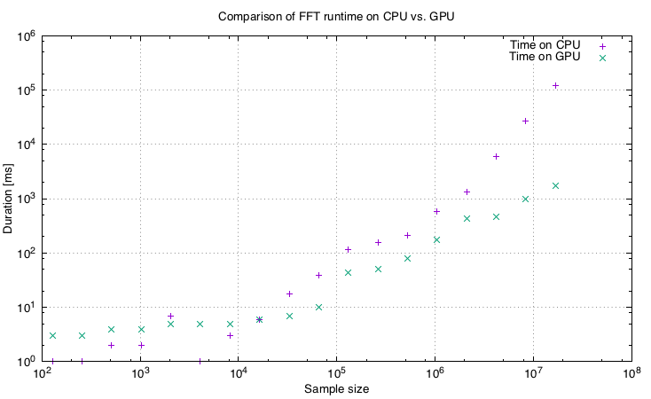

# Equalizer writen in Kotlin using OpenCL

I always wanted to write something in CUDA or OpenCL.
Recently I came across the Aparapi from AMD, which allows you to write OpenCL code in pure Java (with some restrictions of course).
I could not resist and wrote Fast Fourier Transformation algorithm using the API.

To demonstrate the FFT I also wrote a small JavaFX app in Kotlin.
The app listens to your microphone and then shows you the frequency spectrum in real time.

## How to run it

I successfully run the app on OSX 11 with Java 8v65 and mvn installed.
The Aparapi library jar together with native x64 libraries is included in the project, so everything should work out of the box.

**Run with VM params**: *-Djava.library.path=./native  -Dcom.amd.aparapi.executionMode=%1*, otherwise the Aparapi will fall back to CPU mode!

## Performance comparison

I tested the performance of the implemented algorithm on my Macbook Pro with Intel Iris Pro graphics. The overhead of copying the data and executing the kernel seems to be in order of miliseconds.
On the following image you can see that with number of samples below 16k the CPU is faster, but with millions of samples the GPU is more than 10x faster.

You do not actually need to calculate FFTs with millions of samples.
To gain great performance improvements the FFTs can be simply calculated on GPU in batches.

# License [MIT](LICENSE)
